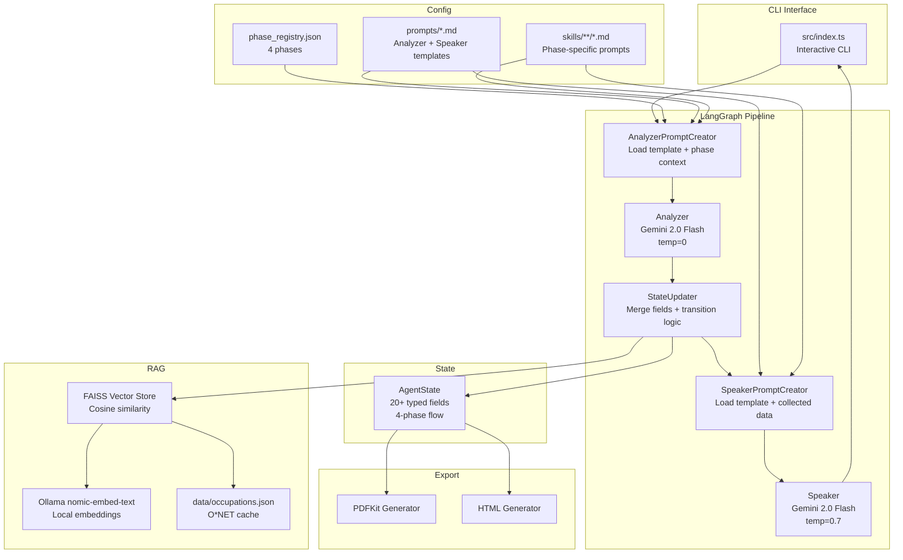
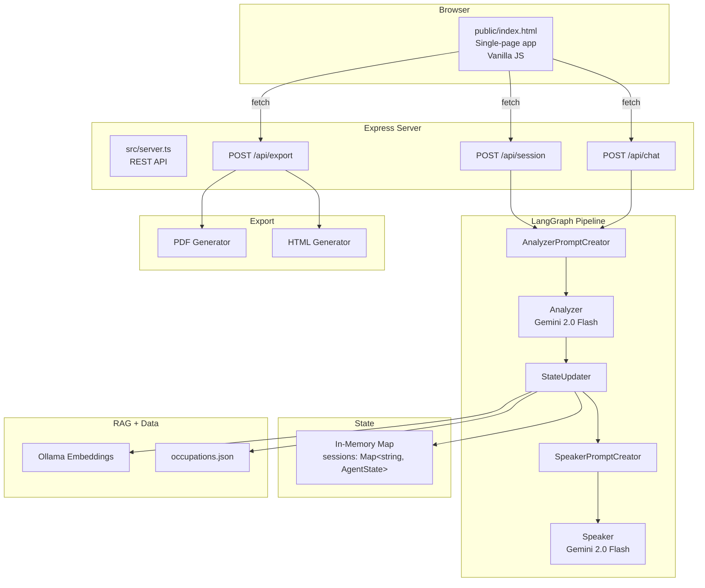
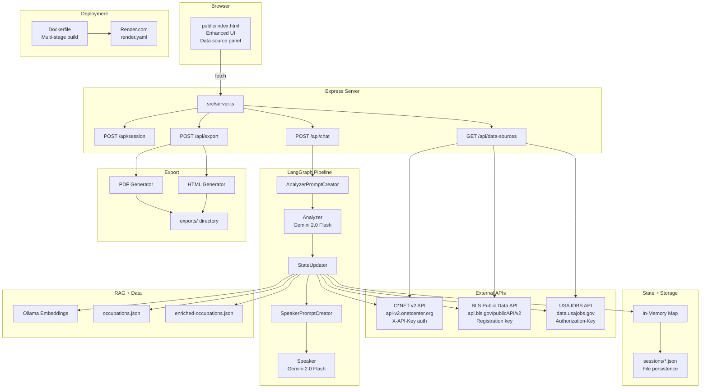
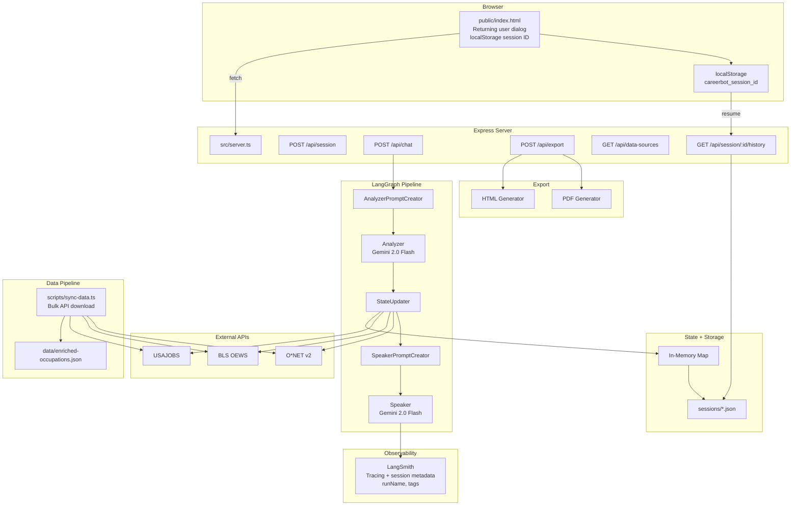
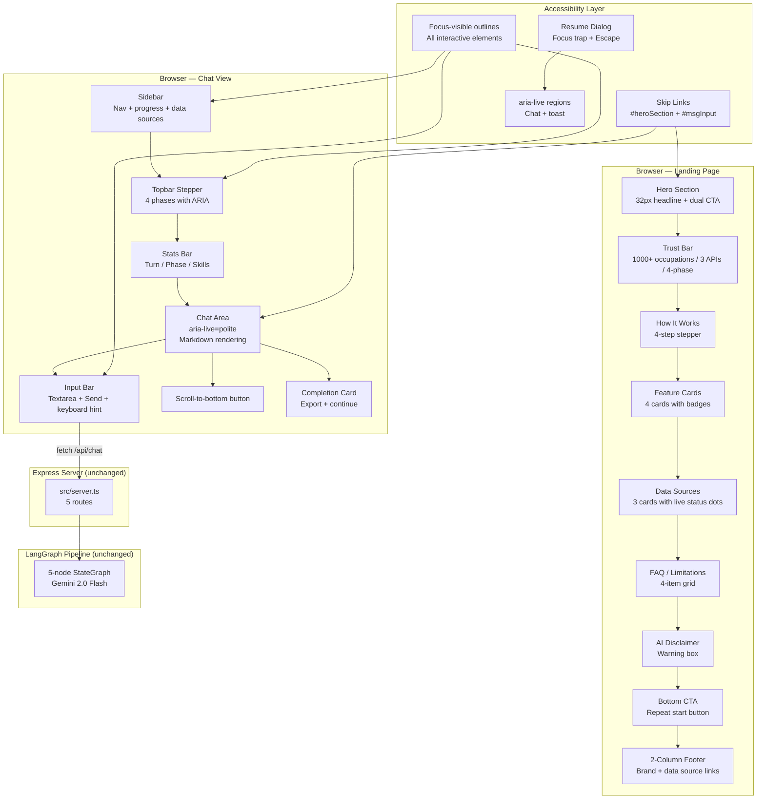

# Architecture Diagrams — Career Guidance AI Assistant

Versioned Mermaid diagrams showing system architecture progression.
Render any diagram at [mermaid.live](https://mermaid.live/) or in GitHub markdown preview.

---

## Version 1.0 — Initial Build
**Date:** 2026-03-27 18:55
**Commit:** `fb37629`
**Summary:** LangGraph 5-node pipeline + CLI interface + RAG + PDF/HTML export



---

## Version 1.1 — Web UI + Express Server
**Date:** 2026-03-27 19:03
**Commit:** `ab531e4`
**Summary:** Added Express HTTP server and browser-based single-page chat UI



---

## Version 1.2 — Live API Integration + Deployment
**Date:** 2026-03-27 23:46
**Commit:** `ccaa61c`
**Summary:** O*NET, BLS, USAJOBS service connectors + Docker + Render deployment



---

## Version 1.3 — Session Persistence + LangSmith Tracing
**Date:** 2026-03-28 01:43 — 2026-03-31 23:14
**Commits:** `27b60ba`, `ca92d4d`, `268e1c4`
**Summary:** File-based persistence, returning user flow, LangSmith observability, data sync script



---

## Version 2.0 — UI Redesign + Accessibility
**Date:** 2026-04-02 00:50 — 10:54
**Commits:** `12090f9`, `76c604c`, `3217772`
**Summary:** 27 UI/UX improvements, PrepStack-inspired redesign, FAQ, disclaimer, 2-column footer. Backend unchanged.



---

## Version 3.0 — Feature Expansion (Planned)
**Date:** 2026-04-02 11:30 (planned)
**Summary:** Resume Intelligence, Mock Interviews, Resources — new route modules, state schema expansion, standalone pipelines

```mermaid
graph TD
    subgraph "Browser"
        UI[public/index.html<br>Multi-view SPA]
        V1[Career Coach View]
        V2[Resume Upload View]
        V3[Interview Practice View]
        V4[Resources View]
        V5[Export View]
    end

    subgraph "Express Server"
        API[src/server.ts<br>Route registration]

        subgraph "Core Routes"
            CR1[POST /api/session]
            CR2[POST /api/chat]
            CR3[GET /api/session/:id/history]
            CR4[GET /api/data-sources]
        end

        subgraph "Resume Routes (NEW)"
            RR1[POST /api/resume/upload<br>Multer + pdf-parse]
            RR2[POST /api/resume/confirm]
            RR3[GET /api/resume/:sessionId]
        end

        subgraph "Interview Routes (NEW)"
            IR1[POST /api/interview/start]
            IR2[POST /api/interview/answer]
            IR3[GET /api/interview/:sessionId]
        end

        subgraph "Resource Routes (NEW)"
            RSR1[GET /api/resources]
        end

        subgraph "Export Routes (UPDATED)"
            ER1[POST /api/export<br>+ resume + interview + resources]
        end
    end

    subgraph "LangGraph Pipeline (unchanged)"
        APC[AnalyzerPromptCreator]
        A[Analyzer]
        SU[StateUpdater]
        SPC[SpeakerPromptCreator]
        S[Speaker]
    end

    subgraph "Resume Pipeline (NEW)"
        MUL[Multer<br>File upload<br>Memory storage]
        PDP[pdf-parse / mammoth<br>Text extraction]
        REX[Resume Extractor<br>Gemini temp=0<br>JSON schema output]
        CONF[Confirm/Edit<br>User review step]
    end

    subgraph "Interview Pipeline (NEW)"
        QG[Question Generator<br>Gemini temp=0.6<br>Mode + role + O*NET]
        GR[Grader<br>Gemini temp=0.1<br>5-dimension rubric]
        PER[Personas<br>Professional Coach<br>Friendly Peer]
    end

    subgraph "Resources Pipeline (NEW)"
        CUR[Curated Resources<br>data/curated-resources.json]
        REC[Recommender<br>Filter by role + skills]
        WS[Web Search<br>Phase 2 — SerpAPI/Tavily]
    end

    subgraph "External APIs"
        ONET[O*NET v2]
        BLS[BLS OEWS]
        USJ[USAJOBS]
    end

    subgraph "State + Storage"
        SS[AgentState<br>+ resumeProfile<br>+ interviewSessions[]<br>+ recommendedResources[]]
        DISK[sessions/*.json]
    end

    subgraph "Export (UPDATED)"
        PDF[PDF Generator<br>+ Resume section<br>+ Interview summary<br>+ Resources list]
        HTML[HTML Generator<br>+ same sections]
    end

    subgraph "Safety Layer"
        SAN[Input sanitization<br>Max 2000 chars]
        INJ[Injection defense<br>Resume text boundaries]
        PII[PII guard<br>No protected characteristics]
    end

    UI --> V1 & V2 & V3 & V4 & V5

    V1 -->|fetch| CR1 & CR2
    V2 -->|fetch| RR1 & RR2 & RR3
    V3 -->|fetch| IR1 & IR2 & IR3
    V4 -->|fetch| RSR1
    V5 -->|fetch| ER1

    CR2 --> APC --> A --> SU --> SPC --> S
    RR1 --> MUL --> PDP --> REX --> CONF
    CONF -->|merge| SS
    IR1 --> QG
    IR2 --> GR
    QG --> PER
    QG --> ONET
    RSR1 --> REC --> CUR
    REC -.->|Phase 2| WS

    SU --> ONET & BLS & USJ
    SS --> DISK
    ER1 --> PDF & HTML

    REX --> SAN & INJ
    GR --> PII
    REC --> SAN
```

---

## Architecture Version Log

| Version | Date | Time | Commit(s) | Summary |
|---------|------|------|-----------|---------|
| 1.0 | 2026-03-27 | 18:55 | `fb37629` | Initial: LangGraph 5-node pipeline + CLI + RAG + export |
| 1.1 | 2026-03-27 | 19:03 | `ab531e4` | Web UI: Express server + single-page HTML app |
| 1.2 | 2026-03-27 | 23:46 | `ccaa61c`, `9a37f7a` | Live APIs: O*NET + BLS + USAJOBS + Docker + Render |
| 1.3 | 2026-03-28 — 03-31 | -- | `27b60ba`...`268e1c4` | Persistence: file sessions + returning user + LangSmith + data sync |
| 2.0 | 2026-04-02 | 00:50–10:54 | `12090f9`, `76c604c`, `3217772` | UI Redesign: 27 improvements + PrepStack layout + FAQ + disclaimer + footer |
| 3.0 | 2026-04-02 | 11:30 | (planned) | Feature Expansion: Resume + Interview + Resources + updated export |
