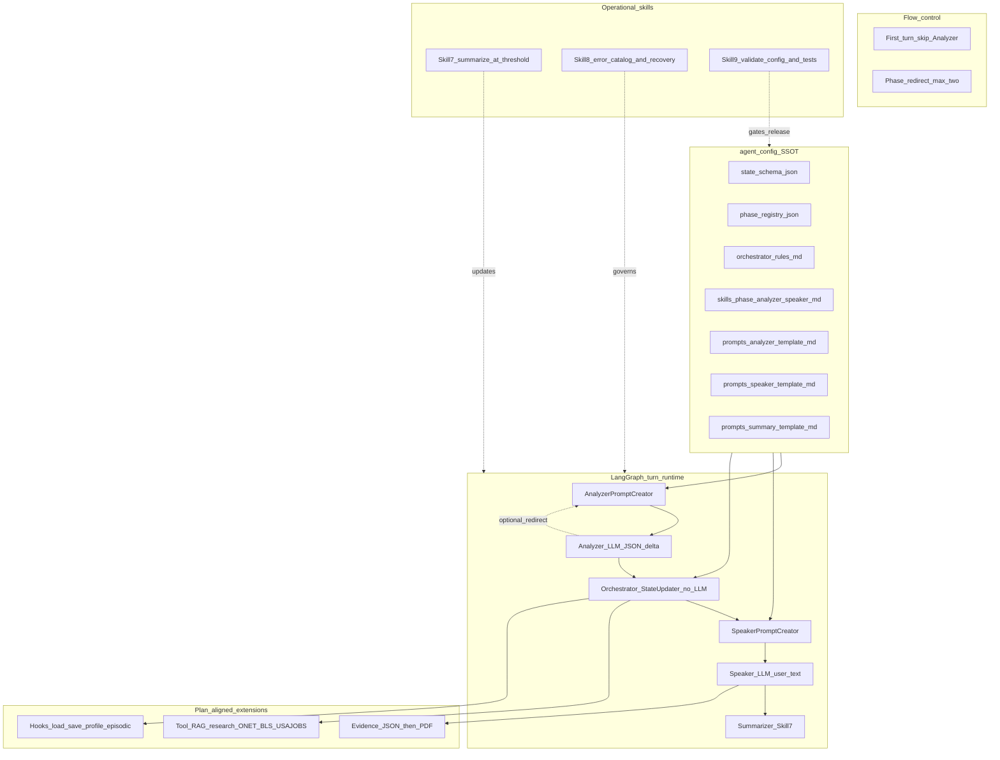
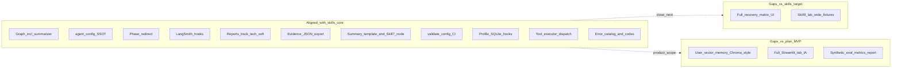
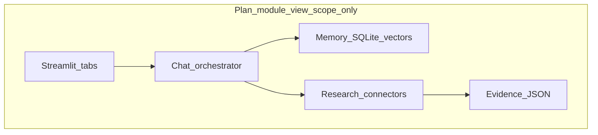

# Target architecture vs current architecture

**Framing**

- **Jan 28, 2026 project plan** defines **product scope**: career chatbot, multi-level memory, public-data research, evidence-style outputs, export, evaluation, and UI expectations.
- **Revised Feb17th chatbot skills** define a **superior / updated conversational architecture**: strict separation of **Analyzer proposes → Orchestrator decides → Speaker communicates**, **configuration-first** design (`agent_config`), and operational patterns (history, errors, testing). That skills model is taken here as the **target architecture** for the agent layer.
- **Current state** is the shipped **`career-guidance-ai`** codebase (TypeScript, LangGraph, Express).

**References:** [`Revised Feb17th_Chatbot Skills/skills-overview-for-students.md`](Revised%20Feb17th_Chatbot%20Skills/skills-overview-for-students.md), [`project_plan_comp_checklist.md`](project_plan_comp_checklist.md), [`career-guidance-ai`](../career-guidance-ai/).

**Code baseline:** `career-guidance-ai` synced with **`origin/main`** at commit **`f82a1bf`** (*Phase 2: close gaps G1-G7 and ship user-story slices S-A through S-H*).

**Last updated:** 2026-04-08 (Phase 3 closure — slices C1–C7 shipped; validate-config now 21/21)

---

## 0. How plan scope maps onto the skills target

| Plan concern (MVP) | Where it lives in the **skills-based target** |
|--------------------|-----------------------------------------------|
| Chat orchestrator / flows | **Phase registry** + **orchestrator rules** + **five-node** runtime (not a separate “intent menu” unless you add one) |
| Multi-level memory | **State** + **hooks** in orchestrator rules (e.g. load profile / save session); **Skill 7** summarization for long transcripts; optional DB/vector **outside** the five nodes but **invoked** from approved hooks |
| Research / evidence | **Extension** of the same pattern: **tool or retrieval step after Orchestrator approval** (overview: Analyzer → Orchestrator → Tool executor → Speaker) |
| Export | Downstream of **state** (and optional evidence JSON), not a sixth LLM role |
| UI | Plan’s Streamlit tabs are **presentation**; skills target is **API + graph**-agnostic |

---

## 1. Target architecture (skills-based — logical view)

Canonical **runtime**: five nodes per turn, with **first-turn** and **phase-redirect** exceptions as in the skills overview. **Configuration** is the source of truth for behavior.



**Target principles (skills):**

1. **Single writer to merged state:** Orchestrator / `state-updater` only (after Analyzer proposes a delta).
2. **Templates + phase skills:** Global rules in `prompts/*_template.md`; domain detail in `skills/<phase>/*.md`.
3. **Explicit artifacts:** `state_schema.json`, `phase_registry.json`, `orchestrator_rules.md` stay consistent (Skill 9 validation).
4. **Conversation memory:** Recent turns + **rolling summary** (Skill 7) to bound context.
5. **Research / evidence (plan):** Implemented as **approved side effects** (retrieval, connectors) and optional **evidence JSON**, not by collapsing “orchestrator” into the LLM.

---

## 2. Current architecture (`career-guidance-ai` — logical view)

```mermaid
flowchart TB
  subgraph ui [UI_Web]
    spa[public_index_html]
  end

  subgraph api [Express_API]
    routes["/api/session_/api/chat_/api/export"]
  end

  subgraph persist [SessionPersistence]
    disk[(sessions_json_per_sessionId)]
    prof[(profiles_sqlite_optional)]
  end

  subgraph graph [LangGraph_runtime]
    apc[AnalyzerPromptCreator]
    an[Analyzer_LLM]
    su[StateUpdater_orchestrator]
    spc[SpeakerPromptCreator]
    sp[Speaker_LLM]
    sum[Summarizer_node]
    apc --> an
    an --> su
    su --> spc
    spc --> sp
    sp --> sum
  end

  subgraph config [agent_config_SSOT]
    ac[state_phase_rules_skills]
    sum_tpl[summary_template_md]
    errcat[error_catalog_md]
  end

  subgraph tools [Tool_executor_dispatch]
    te[tool_executor_ts]
    ws[web_search_courses]
    retrieve[retrieve_skills_RAG]
  end

  subgraph rag [Research_data]
    data[data_embeddings_occupations]
    svc[services_onet_bls_usajobs]
  end

  subgraph out [Export]
    pdf[pdf_generator]
    html[html_generator]
    ep[evidence_pack_json]
  end

  spa --> routes
  routes --> graph
  routes --> disk
  routes --> prof
  graph --> disk
  ac --> apc
  ac --> spc
  su --> te
  te --> retrieve
  te --> ws
  retrieve --> data
  retrieve --> svc
  routes --> pdf
  routes --> html
  routes --> ep
```

**Notes:** Phase redirect and first-turn behavior match the skills pattern. **`state-updater`** calls **`runTool`** in [`tool-executor.ts`](../career-guidance-ai/src/nodes/tool-executor.ts) for **orchestrator-approved** side effects: **RAG** role skills, **`web_search`**, **`find_courses`**. After **Speaker**, the graph runs **`summarizerNode`** (Skill 7 — rolling summary; prompt from **`summary_template.md`**); summarization is **no longer** a `server.ts`-only side effect. Profile + episodic hooks use **`profile-db.ts`** / **`profile-hooks.ts`**; **plain-text resume** intake via **`POST /api/upload`** + [`resume-parser.ts`](../career-guidance-ai/src/services/resume-parser.ts). **`agent_config/error_catalog.md`** and **`src/utils/errors.ts`** back Skill 8-style codes; **`safety-guard.ts`** / **`topic-guard.ts`** support policy checks in the orchestration path.

**Recent alignment (post–`f82a1bf`):** Phase 2 closes skills gaps **G1–G7** (incl. **summary template**, **graph-integrated summarizer**, **explicit tool executor**, **error catalog**, orchestrator/topic/safety enhancements, resume slice **S-C**, web/course tools). Prior **2cc1086** deliverables (evidence JSON, SQLite profile, sidebar, CI, exports) remain; see [`graph.ts`](../career-guidance-ai/src/graph.ts) (`speaker` → `summarizer` → `END`).

---

## 3. Target (skills-aligned) vs current — comparison

| Area | Target (skills architecture + plan extensions) | Current (`career-guidance-ai`) | Match |
|------|-----------------------------------------------|--------------------------------|-------|
| **Core dialogue pipeline** | APC → Analyzer → Orchestrator → SPC → Speaker → **Summarizer** (then END) | Same sequence in `graph.ts` (summarizer threshold-gated) | Strong |
| **First-turn exception** | Skip Analyzer path; opening from Speaker path | Implemented via `turnType` / `speaker-prompt-creator` | Strong |
| **Phase redirect loop** | Max two redirects, then rephrase | `routeAfterAnalyzer` + `userChangedPhase` / `maxPhaseRedirects` | Strong |
| **State schema + phase registry + orchestrator rules** | SSOT in `agent_config` | Present: `state_schema.json`, `phase_registry.json`, `orchestrator_rules.md` | Strong |
| **Per-phase analyzer / speaker skills** | One folder per phase | `agent_config/skills/*` | Strong |
| **Framework templates** | `analyzer_template.md`, `speaker_template.md`, **`summary_template.md`** | All three present; summary used by **`summarizer.ts`** | Strong |
| **Skill 7 summarization** | LLM summary when over turn threshold; feeds prompts | **`summarizerNode`** after Speaker in **`graph.ts`**; **`maybeSummarize`** + **`summary_template.md`**; cadence mirrors former `server.ts` gate | Strong |
| **Skill 8 error recovery** | Error catalog, recovery matrix, structured logging | **`error_catalog.md`** (Recovery column), **`errors.ts`** `RecoveryStrategy` + `recoveryFor()` (C7), `AgentError`, tool `errorCode`s | Strong |
| **Skill 9 delivery gate** | `validate_config.ts` + fixtures + smoke | **`validate-config.ts`** **21/21** incl. cross-artifact drift checks (C6), `npm run eval` 30/30, CI | Strong |
| **Skill 10 process** | Staged generation / consistency of config | Artifacts exist; process is manual / ad hoc | Partial |
| **Orchestrator hooks (SQLite, episodic, resumption)** | Documented in `orchestrator_rules.md` | **`profile-db.ts`** + **`profile-hooks.ts`**; C3 wires `listRecentEpisodic` into S-B welcome-back; rules expanded | Strong |
| **Tool / research pattern** | Explicit **tool executor** after Orchestrator | **`runTool`** in **`tool-executor.ts`** (`retrieve_skills_for_role`, `web_search`, `find_courses`) invoked from **`state-updater`** | Strong |
| **Plan: keep / discard evidence log** | Part of research/evidence extension | **`evidenceKept` / `evidenceDiscarded`** in state + Evidence UI + pack | Partial |
| **Plan: evidence JSON artifact** | Distinct schema file or export | **`buildEvidencePack`** + file under `exports/`; download via **`format=json`** | Strong |
| **Export** | PDF/HTML (plan-aligned) | PDF + HTML; **track-aware** sections; **technical vs soft** skill layout in reports | Strong |
| **UI** | Plan suggested tabs; skills target UI-agnostic | Sidebar + chat (**Career Coach**, Evidence, Profile, History, Skills Dashboard, Explore, Resources, Export) | Partial vs plan |
| **Observability** | Recommended for production agents | LangSmith-ready (`server.ts` + env) | Strong |

---

## 4. Gap view (current vs **skills-based target**)

Prioritize closing **skills** gaps (summaries, validation, error catalog) in parallel with **plan** gaps (SQLite profile, evidence log, tabbed UI).



---

## 5. Legacy reference: Jan 28 plan module diagram (superseded as *architectural* target)

The plan’s **five-box** diagram (Streamlit, Chat Orchestrator, Memory Service, Research Service, Evidence Pack) remains valid for **stakeholder scope** and **backlog**. For **how** the conversational core should be built, the **skills architecture above** is the preferred target; the boxes then map to **services and hooks around** that core (see section 0).



---

## How to use this doc

- Use **section 1** as the **skills target** for design reviews; **section 3** for sprint planning.
- Keep **row-level checklist** detail in [`project_plan_comp_checklist.md`](project_plan_comp_checklist.md).
- Bump **Last updated** when the codebase or skills baseline changes.
