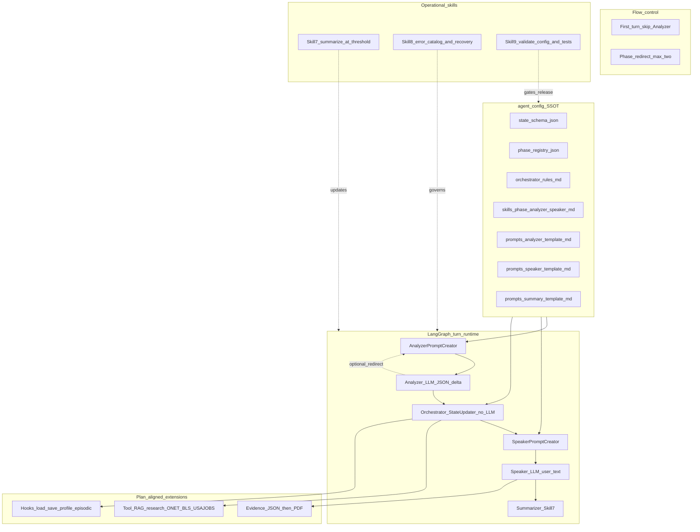
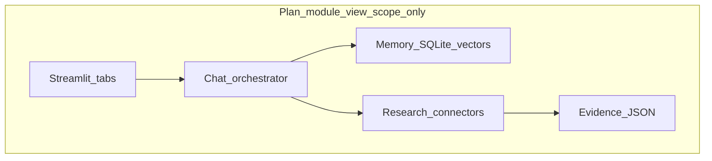

# Target architecture vs current architecture

**Git sync (local `career-guidance-ai`):** **`origin/main`** @ **`74f4376`** (*fix: stop chatbot re-suggesting roles and trim repetitive report sections*). Sync confirmed **2026-04-13** (`git fetch` + `reset --hard`; no newer commit than **`74f4376`**).

### Governance (how to read this document)

1. **Jan 28, 2026 project plan** supplies **product scope** for the **career guidance chatbot** (memory, research, evidence, export, evaluation, UX narrative). It does **not** obligate **Python** or **Streamlit**.

2. **Skills 1–10** and **`implementation_spec.md`** ([`Revised Feb17th_Chatbot Skills/`](Revised%20Feb17th_Chatbot%20Skills/)) are the **authoritative technical architecture** for the agent layer (five-role runtime pattern, `agent_config` SSOT, orchestrator rules, prompts, validation, errors, testing, domain process).

3. Where the plan names technologies (e.g. Streamlit tabs, Python services), **skills + implementation_spec override**; this doc compares **target (skills)** vs **current (repo)** in those terms.

4. **Plan-only deltas** not specified in skills 1–10 or implementation_spec are **tracked in the project plan checklist** and **audit** as separate delivery work.

**Framing**

- **Project plan** = scope and stakeholder outcomes for the career guidance product.
- **Revised Feb17th skills + implementation_spec** = **target** conversational architecture: **Analyzer proposes → Orchestrator decides → Speaker communicates**, **configuration-first** `agent_config`, operational patterns (history, errors, testing).
- **Current state** = shipped **`career-guidance-ai`** (TypeScript, LangGraph, Express, web UI)—**aligned to skills**, not to legacy plan stack names.

**References:** [`skills-overview-for-students.md`](Revised%20Feb17th_Chatbot%20Skills/skills-overview-for-students.md), [`implementation_spec.md`](Revised%20Feb17th_Chatbot%20Skills/implementation_spec.md), [`project_plan_comp_checklist.md`](project_plan_comp_checklist.md), [`career-guidance-ai`](../career-guidance-ai/).

**Code baseline:** `career-guidance-ai` **`origin/main`** @ **`74f4376`**.

**Last updated:** 2026-04-13

**Column guide (§3):** **Match (baseline)** reflects the **pre–Phase 2** comparison (prior doc, **~`2cc1086`**). **Alignment (2026-04-13)** reflects **`74f4376`**. Values: **Strong** / **Partial** / **Gap**.

---

## 0. How plan scope maps onto the skills target

| Plan concern (MVP) | Where it lives in the **skills-based target** |
|--------------------|-----------------------------------------------|
| Chat orchestrator / flows | **Phase registry** + **orchestrator rules** + **five-node** runtime (not a separate “intent menu” unless you add one) |
| Multi-level memory | **State** + **hooks** in orchestrator rules (e.g. load profile / save session); **Skill 7** summarization for long transcripts; optional DB/vector **outside** the five nodes but **invoked** from approved hooks |
| Research / evidence | **Extension** of the same pattern: **tool or retrieval step after Orchestrator approval** (overview: Analyzer → Orchestrator → Tool executor → Speaker) |
| Export | Downstream of **state** (and optional evidence JSON), not a sixth LLM role |
| UI | Plan may describe tabbed IA (e.g. Streamlit-style); **skills target** is **API + graph**-agnostic; shipped UI is **web** (not Streamlit) |

---

## 1. Target architecture (skills-based — logical view)

Canonical **runtime**: five nodes per turn, with **first-turn** and **phase-redirect** exceptions as in the skills overview. **Configuration** is the source of truth for behavior.



**Target principles (skills):**

1. **Single writer to merged state:** Orchestrator / `state-updater` only (after Analyzer proposes a delta).
2. **Templates + phase skills:** Global rules in `prompts/*_template.md`; domain detail in `skills/<phase>/*.md`.
3. **Explicit artifacts:** `state_schema.json`, `phase_registry.json`, `orchestrator_rules.md` stay consistent (Skill 9 validation).
4. **Conversation memory:** Recent turns + **rolling summary** (Skill 7) to bound context.
5. **Research / evidence (plan):** Implemented as **approved side effects** (retrieval, connectors) and optional **evidence JSON**, not by collapsing “orchestrator” into the LLM.

---

## 2. Current architecture (`career-guidance-ai` — logical view)

**`74f4376` graph:** **`parallelTurn`** (P9: concurrent analyzer + speaker LLMs inside one node) → **`stateUpdater`** → **`shouldSummarize`** → **`summarizer`** or **END** — see [`graph.ts`](../career-guidance-ai/src/graph.ts). (Mermaid below omits the conditional for readability.)

```mermaid
flowchart TB
  subgraph ui [UI_Web]
    spa[public_index_html]
  end

  subgraph api [Express_API]
    routes["/api/session_/api/chat_/api/export"]
  end

  subgraph persist [SessionPersistence]
    disk[(sessions_json_per_sessionId)]
    prof[(profiles_sqlite_optional)]
  end

  subgraph graph [LangGraph_runtime]
    pt[parallelTurn_P9]
    su[StateUpdater_orchestrator]
    sum[Summarizer_node]
    pt --> su
    su --> sum
  end

  subgraph config [agent_config_SSOT]
    ac[state_phase_rules_skills]
    sum_tpl[summary_template_md]
    errcat[error_catalog_md]
  end

  subgraph tools [Tool_executor_dispatch]
    te[tool_executor_ts]
    ws[web_search_courses]
    retrieve[retrieve_skills_RAG]
  end

  subgraph rag [Research_data]
    data[data_embeddings_occupations]
    svc[services_onet_bls_usajobs]
  end

  subgraph out [Export]
    pdf[pdf_generator]
    html[html_generator]
    ep[evidence_pack_json]
  end

  spa --> routes
  routes --> graph
  routes --> disk
  routes --> prof
  graph --> disk
  ac --> pt
  su --> te
  te --> retrieve
  te --> ws
  retrieve --> data
  retrieve --> svc
  routes --> pdf
  routes --> html
  routes --> ep
```

**Notes:** **`parallelTurn`** ([`parallel-turn.ts`](../career-guidance-ai/src/nodes/parallel-turn.ts)) runs **analyzer** and **speaker** **concurrently** after building prompts from the **same** pre-merge state (P9), preserving phase-redirect behavior inline. **`state-updater`** merges analyzer output for the **next** turn and invokes **`runTool`** where needed. **`shouldSummarize`** gates the **Skill 7** node. **Returning users:** [`server.ts`](../career-guidance-ai/src/server.ts) sets **`isReturningUser`**, optional **`resumeChoice`**, **`detectResumeIntent`** (resume vs **fresh start**), and **`applyFreshStart`**. Resume text: **`POST /api/upload`** + [`resume-parser.ts`](../career-guidance-ai/src/services/resume-parser.ts). **`common-schema.ts`** shares typed interchange across connectors. **`error_catalog.md`**, **`errors.ts`**, **`safety-guard.ts`**, **`topic-guard.ts`** as before.

**Recent alignment (through `74f4376`):** **P9 parallel LLM turn**, **returning-user resume/fresh-start** wiring, **state / migration hardening**, **`common-schema`**, Dockerfile / deploy notes, expanded **validate-config**, and phase/skill prompt updates. **`74f4376`:** less redundant **role re-suggestion** in chat and **trimmed repetitive sections** in PDF/HTML reports.

---

## 3. Target (skills-aligned) vs current — comparison

### Table 1 — Established dimensions (baseline snapshot vs **2026-04-13**)

| Area | Target (skills architecture + plan extensions) | Current (`career-guidance-ai`) | Match (baseline) | Alignment (2026-04-13) |
|------|-----------------------------------------------|--------------------------------|------------------|-------------------------|
| **Primary graph path (through Speaker)** | APC → Analyzer → Orchestrator → SPC → Speaker | Sequential chain in `graph.ts` through **`speaker`** (pre-`8db0222`) | Strong | **Strong** — **superseded by `parallelTurn`** (Table 2): concurrent analyzer+speaker, then `stateUpdater` |
| **First-turn exception** | Skip Analyzer path; opening from Speaker path | Implemented via `turnType` / `speaker-prompt-creator` | Strong | Strong |
| **Phase redirect loop** | Max two redirects, then rephrase | Preserved inside `parallelTurn` + `routeAfterAnalyzer` semantics | Strong | Strong |
| **State schema + phase registry + orchestrator rules** | SSOT in `agent_config` | Present: `state_schema.json`, `phase_registry.json`, `orchestrator_rules.md` | Strong | Strong |
| **Per-phase analyzer / speaker skills** | One folder per phase | `agent_config/skills/*` | Strong | Strong |
| **Framework templates** | `analyzer_template.md`, `speaker_template.md`, **`summary_template.md`** | Analyzer + speaker only; **no** `summary_template.md` | Gap | **Strong** |
| **Skill 7 summarization** | LLM summary when over turn threshold; feeds prompts | `maybeSummarize` from **`server.ts`**; **not** in `graph.ts` | Partial | **Strong** — conditional **`summarizer`** after `stateUpdater` |
| **Skill 8 error recovery** | Error catalog, recovery matrix, structured logging | Retries in nodes; rules in MD; **no** full catalog | Partial | **Partial** — `error_catalog.md`, `errors.ts`, tool `errorCode`s |
| **Skill 9 delivery gate** | `validate_config.ts` + fixtures + smoke | `validate-config.ts`, CI, smoke, eval fixtures; not full lab parity | Partial | **Partial** — expanded validation (through **`74f4376`**) |
| **Skill 10 process** | Staged generation / consistency of config | Artifacts exist; process is manual / ad hoc | Partial | Partial |
| **Orchestrator hooks (SQLite, episodic, resumption)** | Documented in `orchestrator_rules.md` | **`profile-db.ts`**; hooks not fully mirrored in `state-updater` | Partial | **Partial** — **improved:** returning-user **resume/fresh** flows in **`server.ts`** |
| **Tool / research pattern** | Explicit **tool executor** after Orchestrator | **Implicit** `retrieveSkillsForRole` in `state-updater` | Partial | **Strong** |
| **Plan: keep / discard evidence log** | Part of research/evidence extension | **`evidenceKept` / `evidenceDiscarded`** + Evidence UI + pack | Partial | Partial |
| **Plan: evidence JSON artifact** | Distinct schema file or export | **`buildEvidencePack`** + `exports/`; **`format=json`** | Strong | Strong |
| **Export** | PDF/HTML (plan-aligned) | PDF + HTML; **track-aware**; **technical vs soft** in reports | Strong | Strong |
| **UI** | Plan suggested tabs; skills target UI-agnostic | Sidebar + chat (Career Coach, Evidence, …) | Partial vs plan | Partial vs plan |
| **Observability** | Recommended for production agents | LangSmith-ready (`server.ts` + env) | Strong | Strong |

### Table 2 — New dimensions (Phase 2 `f82a1bf` + **`74f4376`**)

| Area | Description | Alignment (2026-04-13) |
|------|-------------|-------------------------|
| **P9 `parallelTurn` node** | Concurrent analyzer + speaker; inline phase redirect | Strong |
| **Conditional summarizer** | `stateUpdater` → `shouldSummarize` → `summarizer` \| `END` | Strong |
| **`tool-executor.ts`** | `runTool`: `retrieve_skills_for_role`, `web_search`, `find_courses` | Strong |
| **Resume intake** | `POST /api/upload` + `resume-parser.ts` | Partial |
| **Returning user UX** | `isReturningUser`, `resumeChoice`, resume vs **fresh start** | Partial |
| **`common-schema.ts`** | Shared connector interchange types | Partial |
| **Safety / topic utilities** | `safety-guard.ts`, `topic-guard.ts` | Partial |
| **Error catalog artifact** | `error_catalog.md` + `AgentError` / tool codes | Partial |

---

## 4. Gap view (current vs **skills-based target**)

Prioritize remaining **skills** gaps (full recovery UX, broader fixtures) alongside **plan** gaps (user-vector memory, full Streamlit-parity IA, synthetic metrics).

```mermaid
flowchart LR
  subgraph aligned [Aligned_with_skills_core]
    A[Parallel_turn_P9]
    B[agent_config_SSOT]
    C[Phase_redirect]
    D[LangSmith_hooks]
    E[Reports_track_tech_soft]
    F[Evidence_JSON_export]
    G[Conditional_summarizer]
    H[validate_config_CI]
    I[Profile_SQLite_hooks]
    J[Tool_executor_dispatch]
    K[Error_catalog_and_codes]
    L[Returning_user_resume_fresh]
  end

  subgraph skill_gaps [Gaps_vs_skills_target]
    S8[Full_recovery_matrix_UI]
    S9[Skill9_lab_wide_fixtures]
  end

  subgraph plan_gaps [Gaps_vs_plan_MVP]
    P1[User_vector_memory_Chroma_style]
    P2[Full_Streamlit_tab_IA]
    P3[Synthetic_eval_metrics_report]
  end

  aligned -.->|close_next| skill_gaps
  aligned -.->|product_scope| plan_gaps
```



---

## 5. Legacy reference: Jan 28 plan module diagram (superseded as *architectural* target)

The plan’s **five-box** diagram (Streamlit, Chat Orchestrator, Memory Service, Research Service, Evidence Pack) remains valid for **stakeholder scope** and **backlog**. For **how** the conversational core should be built, the **skills architecture above** is the preferred target; the boxes then map to **services and hooks around** that core (see section 0).



---

## 6. Memory, RAG, ReAct, and context (plain summary — `74f4376`)

This section is for **stakeholders** who ask how “memory,” “RAG,” and “ReAct” show up in the **current** build. It uses simple wording; the code paths are the real source of truth.

- **Memory (what persists)**  
  - **Same chat:** `conversationHistory`, structured fields in LangGraph state (`src/state.ts`), updated each turn by **`parallelTurn`** then **`stateUpdater`**.  
  - **Across restarts:** `sessions` table + optional JSON files (`src/server.ts`, `src/db/profile-db.ts`).  
  - **Across visits (optional `userId`):** profile payload, episodic summary rows, skill ratings by role in SQLite.  
  - **Not in this build:** a **vector database of the user** (FAISS here indexes **occupation / career knowledge**, not personal chat memory).

- **RAG (retrieval-augmented generation)**  
  - **Yes, for career knowledge:** embeddings + FAISS + chunk data under `data/`, used via **`src/utils/rag.ts`** and **`runTool`** (`retrieve_skills_for_role`, etc.).  
  - **Purpose:** ground role/skill/evidence answers in **O*NET-style** data (and related services), not to replace the **structured state** that stores what the user said.

- **ReAct (reason → act → observe loop)**  
  - **Implemented behind feature flag** (Change 5, 2026-04-15) — `src/nodes/react-executor.ts`, 139 lines.
  - **Gated on:** `ENABLE_REACT_LOOP=true` env var **and** orchestrator-set `state.reactIntent = "deep_research_role"` + `state.pendingReactTool`. Default OFF → byte-identical to the prior fixed pipeline.
  - **Hard caps (addressing professor's "ReAct gets in a loop" warning):** 3 tool iterations, 15 s wall-clock, 5-tool allowlist (`retrieve_skills_for_role`, `web_search`, `get_wage_data`, `get_job_counts`, `find_courses`).
  - **Fallback on any cap trip:** clear `reactIntent` + `pendingReactTool` → graph routes to normal speaker → accumulated `reactObservationLog` fed forward as "Deep research summary" context block. No silent loop, no hang.
  - **Observability:** every step emits `event: "react_step"` structured JSON to stderr + LangSmith span (when `LANGCHAIN_TRACING_V2=true`).
  - **Default-path behavior unchanged:** one **Analyzer** JSON pass + **Orchestrator** (`state-updater.ts`) + **optional tool calls** the orchestrator approves + **Speaker** reply — closer to a **fixed pipeline** than repeated Thought/Action/Observation cycles. ReAct only activates when the orchestrator explicitly sets `reactIntent`.

- **Context during chat**  
  - Recent turns, rolling summary (`conversationSummary`), phase-specific fields, and prompt templates are **combined in prompt creators** before each LLM call.  
  - After each turn, merged state is **saved** so the next message continues from the same snapshot.

---

## 7. Skills 1–10 — strict gap snapshot (`74f4376`)

Quick read for audits. **Aligned** = matches the skill’s intent in code/config; **Partial** = present but incomplete or doc/code drift; **Gap** = missing or materially different.

| Skill | Topic | Alignment | Short note |
|-------|--------|-------------|------------|
| **1** | Phase skill authoring (`agent_config/skills/...`) | **Aligned** | Per-phase `analyzer.md` / `speaker.md` exist. |
| **2** | Analyzer prompt engineering | **Aligned** | Template + phase skill + history; JSON extraction in `analyzer.ts`. |
| **3** | Speaker prompt engineering | **Aligned** | Template + phase skill + context in `speaker-prompt-creator.ts`. |
| **4** | State schema design | **Partial** | Runtime truth is **`state.ts`**; `state_schema.json` is companion + validation — keep both in sync manually. |
| **5** | Phase registry | **Aligned** | `phase_registry.json` drives phases in `config.ts`. |
| **6** | Orchestrator rules | **Partial** | `orchestrator_rules.md` documents BRs; **`state-updater.ts`** implements them — not auto-loaded from MD. Some rules (e.g. confidence wording, full handoff) are **not** fully enforced in code. |
| **7** | Conversation history / summary | **Aligned** | History reducer + conditional **`summarizer`** node + `summary_template.md`. |
| **8** | Error recovery | **Partial** | `error_catalog.md`, `errors.ts`, strikes; full recovery matrix / BR-6 handoff **not** complete. |
| **9** | Testing / debugging | **Partial** | `validate-config.ts`, smoke, fixtures, CI — not full lab-style coverage. |
| **10** | Domain customization | **Partial** | Strong `agent_config/` for this domain; formal Skill-10 **generation process** is informal in repo. |
| **Spec extra** | Textbook **five-node sequential** graph | **Different** | Shipped graph uses **`parallelTurn`** (P9) + **`stateUpdater`** + summarizer — same **roles**, different **topology**. |
| **Spec / overview extra** | **ReAct** multi-step tool loop | **Partial (flag-gated — Change 5)** | Scoped ReAct shipped on 2026-04-15 behind `ENABLE_REACT_LOOP` + `reactIntent`. Hard caps: 3 steps / 15 s / 5-tool allowlist. Default path unchanged. |
| **Spec extra** | **Zod** validation in nodes | **Gap** | Dependency may exist; **not** used in `src/` for analyzer output parsing per prior audit. |

---

## How to use this doc

- Use **section 1** as the **skills target** for design reviews; **section 3** for sprint planning.
- Use **sections 6–7** for **demo Q&A** on memory, RAG, ReAct, and skills coverage.
- Keep **row-level checklist** detail in [`project_plan_comp_checklist.md`](project_plan_comp_checklist.md).
- Bump **Last updated** when the codebase or skills baseline changes.
